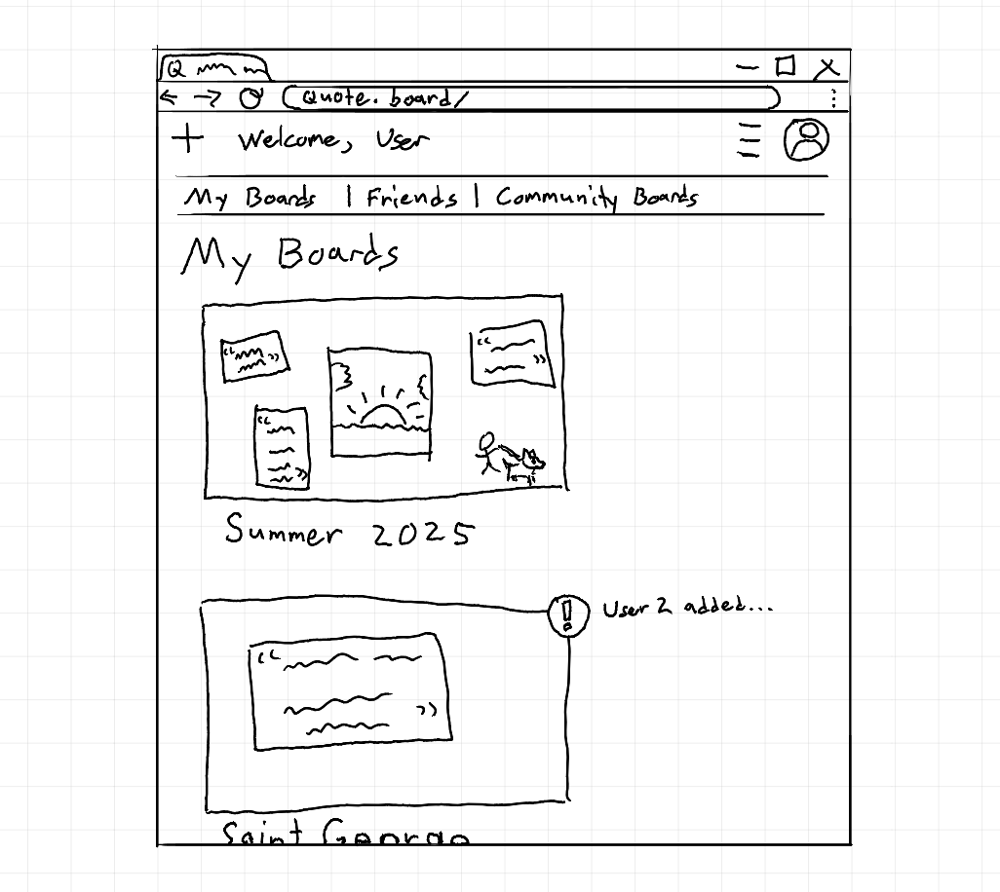

# QuoteBoard

[My Notes](notes.md)

> Updated 9/8/25 with specs

A brief description of the application here. Lorem ipsum dolor sit amet, consectetur adipiscing elit, sed do eiusmod tempor incididunt ut labore et dolore magna aliqua. Ut enim ad minim veniam, quis nostrud exercitation ullamco laboris nisi ut aliquip ex ea commodo consequat. Duis aute irure dolor in reprehenderit in voluptate velit esse cillum dolore eu fugiat nulla pariatur. Excepteur sint occaecat cupidatat non proident, sunt in culpa qui officia deserunt mollit anim id est laborum.

> [!NOTE]
>  This is a template for your startup application. You must modify this `README.md` file for each phase of your development. You only need to fill in the section for each deliverable when that deliverable is submitted in Canvas. Without completing the section for a deliverable, the TA will not know what to look for when grading your submission. Feel free to add additional information to each deliverable description, but make sure you at least have the list of rubric items and a description of what you did for each item.

> [!NOTE]
>  If you are not familiar with Markdown then you should review the [documentation](https://docs.github.com/en/get-started/writing-on-github/getting-started-with-writing-and-formatting-on-github/basic-writing-and-formatting-syntax) before continuing.

## 🚀 Specification Deliverable

> [!NOTE]
>  Fill in this sections as the submission artifact for this deliverable. You can refer to this [example](https://github.com/webprogramming260/startup-example/blob/main/README.md) for inspiration.

For this deliverable I did the following. I checked the box `[x]` and added a description for things I completed.

- [x] Proper use of Markdown
- [x] A concise and compelling elevator pitch
- [x] Description of key features
- [x] Description of how you will use each technology
- [x] One or more rough sketches of your application. Images must be embedded in this file using Markdown image references.

### Elevator pitch

QuoteBoard is a place to collaboratively store memories through the use of "boards", where users and their friends can dynamically add quotes, pictures, and doodles to create a personalized digital scrapbook. Registered users can also contribute to public community boards, where they can create with people who share their interests.

### Design

> Mockup; user's home page.

### Key features

- Register/login; show different views when logged in.
- Board creation. Support the following, in order of priority: 1. text 2. images 3. drawings 4. locations
- Social features; friends/requests, sharing boards, dynamic collaboration using WebSocket.

### Technologies

I am going to use the required technologies in the following ways.

- **HTML** - Create separate views so users can choose to browse their own boards, their friends' boards, or community boards.
- **CSS** - Design an unobtrusive and focused UI so users can focus on creating.
- **React** - Utilize specialized components that will allow users to make doodles directly in the browser.
- **Service** - Provide geotagging functionality through the Maps API so users can add locations to boards.
- **DB/Login** - Display in a view-only mode for unregistered users, and provide functionality for users to choose whether to make a board private, public, or shared with friends only.
- **WebSocket** - Update boards dynamically so multiple users can work together at the same time to foster collaboration.

## 🚀 AWS deliverable

For this deliverable I did the following. I checked the box `[x]` and added a description for things I completed.

- [ ] **Server deployed and accessible with custom domain name** - [My server link](https://yourdomainnamehere.click).

## 🚀 HTML deliverable

For this deliverable I did the following. I checked the box `[x]` and added a description for things I completed.

- [x] **HTML pages** - I created views for every part of my project.
- [x] **Proper HTML element usage** - I organized my page with headers, footers, navs, divs, and tables.
- [x] **Links** - All pages are properly linked.
- [x] **Text** - I included placeholder "about" text on my homepage.
- [x] **3rd party API placeholder** - I have a line on my login view that indicates I plan to use a 3rd party to process user accounts.
- [x] **Images** - I included profile images on the profile view and the friend request table.
- [x] **Login placeholder** - I created a login view with placeholder fields.
- [x] **DB data placeholder** - My "User Boards", "Friends' Boards", and "Community Boards" views will all query a DB to get their content. I will also likely store friend list & friend request information in a DB.
- [x] **WebSocket placeholder** - My "Edit Board" view indicates that it will use WebSocket to display boards live. My friend request table may also use WebSocket so it can update live, but that is lower-priority.

## 🚀 CSS deliverable

For this deliverable I did the following. I checked the box `[x]` and added a description for things I completed.

- [ ] **Header, footer, and main content body** - I did not complete this part of the deliverable.
- [ ] **Navigation elements** - I did not complete this part of the deliverable.
- [ ] **Responsive to window resizing** - I did not complete this part of the deliverable.
- [ ] **Application elements** - I did not complete this part of the deliverable.
- [ ] **Application text content** - I did not complete this part of the deliverable.
- [ ] **Application images** - I did not complete this part of the deliverable.

## 🚀 React part 1: Routing deliverable

For this deliverable I did the following. I checked the box `[x]` and added a description for things I completed.

- [ ] **Bundled using Vite** - I did not complete this part of the deliverable.
- [ ] **Components** - I did not complete this part of the deliverable.
- [ ] **Router** - I did not complete this part of the deliverable.

## 🚀 React part 2: Reactivity deliverable

For this deliverable I did the following. I checked the box `[x]` and added a description for things I completed.

- [ ] **All functionality implemented or mocked out** - I did not complete this part of the deliverable.
- [ ] **Hooks** - I did not complete this part of the deliverable.

## 🚀 Service deliverable

For this deliverable I did the following. I checked the box `[x]` and added a description for things I completed.

- [ ] **Node.js/Express HTTP service** - I did not complete this part of the deliverable.
- [ ] **Static middleware for frontend** - I did not complete this part of the deliverable.
- [ ] **Calls to third party endpoints** - I did not complete this part of the deliverable.
- [ ] **Backend service endpoints** - I did not complete this part of the deliverable.
- [ ] **Frontend calls service endpoints** - I did not complete this part of the deliverable.
- [ ] **Supports registration, login, logout, and restricted endpoint** - I did not complete this part of the deliverable.

## 🚀 DB deliverable

For this deliverable I did the following. I checked the box `[x]` and added a description for things I completed.

- [ ] **Stores data in MongoDB** - I did not complete this part of the deliverable.
- [ ] **Stores credentials in MongoDB** - I did not complete this part of the deliverable.

## 🚀 WebSocket deliverable

For this deliverable I did the following. I checked the box `[x]` and added a description for things I completed.

- [ ] **Backend listens for WebSocket connection** - I did not complete this part of the deliverable.
- [ ] **Frontend makes WebSocket connection** - I did not complete this part of the deliverable.
- [ ] **Data sent over WebSocket connection** - I did not complete this part of the deliverable.
- [ ] **WebSocket data displayed** - I did not complete this part of the deliverable.
- [ ] **Application is fully functional** - I did not complete this part of the deliverable.
